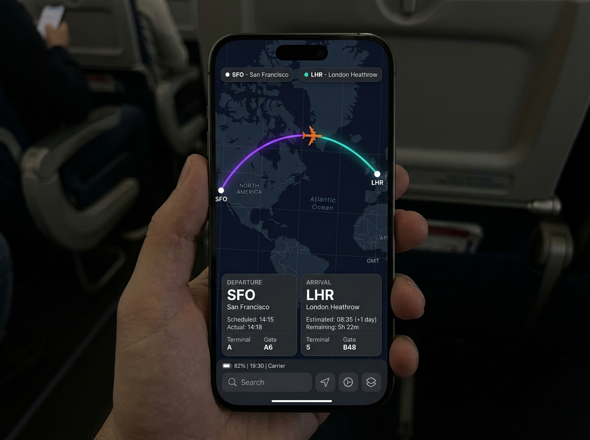

# ✈️ Aviation OSS

An offline-first, cached flight tracker and aviation data search tool powered by the **Aviationstack API** and Android Jetpack Compose.

---

## 🎨 Visual Preview

<p align="center">
  
</p>

### 🗺️ Live Route Visualization
<p align="center">
  
</p>

---

## 🌟 Key Features

### 📡 1. Intelligent Live Search & Autocomplete
* **Real-time Suggestions**: Suggests routes, airlines, and airports as you type.
* **Smart Filtering**: Instant local and remote search results matching flights dynamically.
* **Polished Search UI**: A dense, clean interface utilizing Material Design 3, including custom icon cues.

### 🗺️ 2. Web-powered Leaflet Map Rendering
* **Interactive Cartography**: Utilizes a customized high-contrast dark leaflet map integrated via Android's `WebView`.
* **Animated Dash Paths**: Displays dotted and animated polyline trajectories connecting origin and destination airports.
* **Live Plane Telemetry**: If the transponder broadcasts active coordinates, an orange live transponder plane maker `✈` is displayed mid-flight.
* **Automated Bounds Fitting**: Computes optimal camera projection sizes automatically so both airports and the plane fit beautifully on compact or wide devices.

### 🔗 3. Daisy-Chained Airport Departures
* **Contextual Airport Telemetry**: Inside a flight's detail cockpit popup, the app automatically interrogates the Aviationstack API to fetch the **very next** upcoming departure sharing that origin.
* **Direct Flight Jumping**: Tap the summary card to transition the details popup directly to the next flight, allowing easy tracking of consecutive routes.

### 🛡️ 4. Offline-First Resilience
* **Room Database Integration**: Every fetched flight query is cached locally inside a SQLite Database.
* **Smart Fallbacks**: If you lose connectivity or run out of free API call credits, the database handles automatic offline lookups.
* **Local Bookmarks**: Securely pin your favorite or recurring commuter flights for quick access in the bookmarks dashboard.

### 🌀 5. Expressive Loading Skeletons
* **Simulated Radar Synchronization**: A custom animated loading skeleton with an infinite rotating radar symbol and pulse indicators provides responsive feed updates.
* **Smooth Shimmer Nodes**: Clean rounded-corner cards with animated linear gradient sweeps prevent jarring white-screen content flashes.

---

## 🛠️ Technological Architecture

* **UI Layer**: 100% Kotlin Jetpack Compose following modern **Material 3 (M3)** density and dynamic-color standardizations.
* **Data Flow**: MVI / MVVM State Managers using StateFlows (`MutableStateFlow`) with `collectAsStateWithLifecycle()` to avoid background memory leaks.
* **Networking**: `Retrofit` + `OkHttpClient` with optimized deserializers for parsing complex nested flight structures.
* **Local Caching**: Jetpack `Room` database utilizing custom indices and SQLite DAO transactions to handle offline read-writes.
* **Map Engine**: Inline JavaScript-driven Leaflet, hosted on a Dark Map Leaflet tile-set loaded inside Android's `WebView`.

---

## 🚀 Getting Started

### API Credentials Configuration
The application accesses Aviationstack. Securely enter your personal api token via the **Secrets panel in AI Studio** using the variable:
```env
AVIATIONSTACK_API_KEY=your_free_or_premium_token_here
```
Or use the in-app **Settings Tab** to override the API key directly on your device.

### Running with Gradle
To sync dependencies and build:
```bash
gradle assembleDebug
```
To run unit and database interface tests:
```bash
gradle :app:testDebugUnitTest
```
